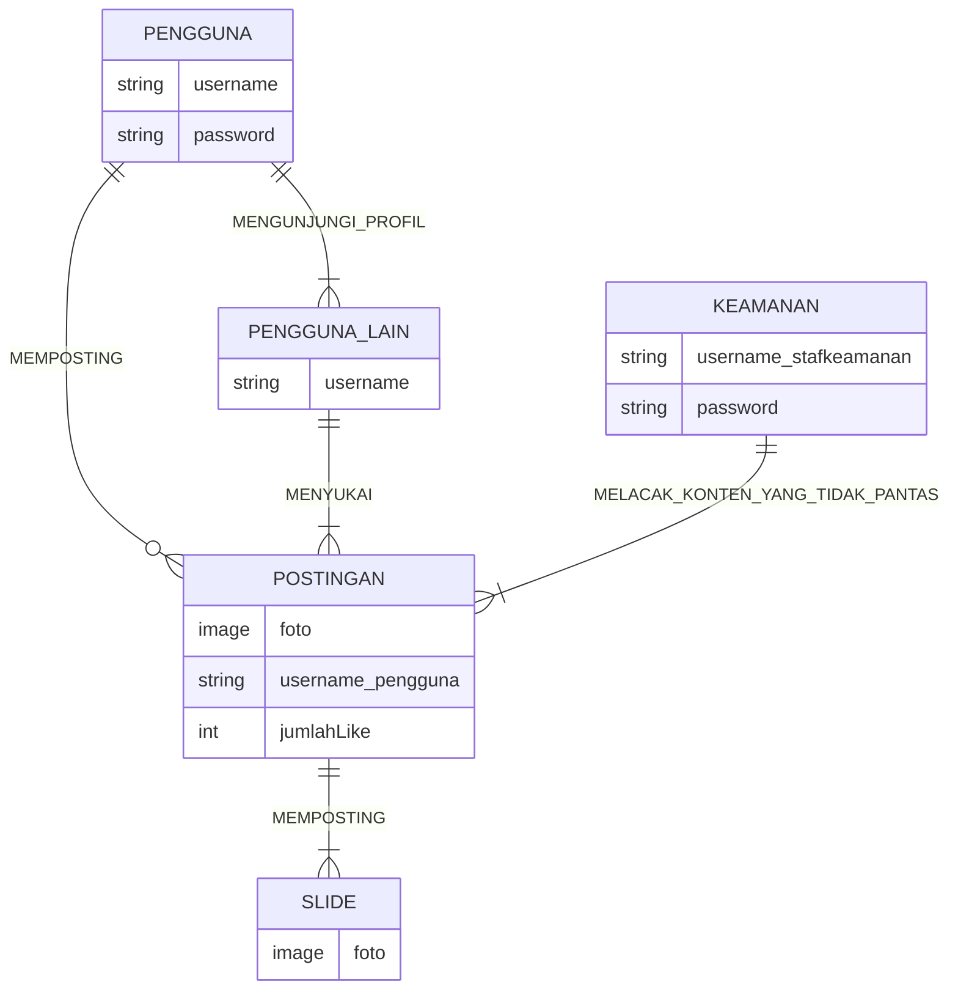
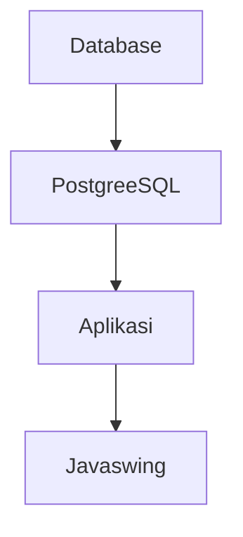

## 1.1 Latar Belakang

   Fotografi adalah proses mengambil gambar menggunakan kamera atau perangkat lain untuk merekam detail       visual dengan bantuan cahaya pada media seperti film atau sensor digital. Tujuan dari fotografi antara lain merekam dan berkomunikasi melalui gambar. Ini bisa digunakan untuk dokumentasi, ekspresi seni, jurnalisme, membagi cerita, mengabadikan momen berharga, dan menyampaikan pesan atau informasi visual kepada penonton. Fotografi memungkinkan orang untuk berbagi pengalaman, mengungkapkan ide, dan merayakan keindahan dunia dalam bentuk gambar.

   Menurut Google dalam "Top 10 Content on Instagram", Fotografi berada dalam urutan ke-7 yang artinya di instgaram, konten dengan kategori fotografi kurang diminati. Sehingga aplikasi ini dibuat agar memudahkan para fotografer atau user yang ingin mencari inspirasi terkait fotografi. Dalam aplikasi yang dibuat ini user dengan mudah bisa langsung melihat karya-karya dari fotografer lain tanpa harus menulis kata kunci di kolom pencarian.

   Aplikasi ini juga bisa memudahkan para fotografer profesional untuk mendemonstrasikan karya-karya mereka yang nantinya bisa menarik perhatian para klien untuk memakai jasa mereka.
   
## 1.2. Deskripsi Teknologi Informasi

    Teknologi Informasi adalah istilah umum untuk teknologi apa pun yang membantu manusia dalam membuat,
    mengubah, menyimpan, mengomunikasikan dan/atau menyebarkan informasi.

    Minoshots adalah sebuah aplikasi yang dibuat untuk para fotografer yang
    sedang mencari inspirasi atau ide untuk memotret. Dengan desain nya yang simple dan mempunyai fitur posting dan
    visit profile dapat memudahkan pengguna untuk berinteraksi.

## 1.3. Branding

    Merk: Minoshots
    Tagline: Inspiration comes from everywhere.
    Campaign: Membuat aplikasi yang berisi inspirasi dalam dunia fotografi.
    Target User: - Fotografer
                        - Orang yang ingin mencari inspirasi potretan
                        - Fotografer yang ingin mencari kenalan sesama fotografer
                        - Traveller yang mencari tempat-tempat indah
    Tema :   Minimalist
    Warna :  Bright and Dark

## 2. User Story

Sebagai | Saya ingin | Sehingga | Level Prioritas
---|---|---|---
Pengguna | Mengupload Foto | Bisa menginspirasi fotografer lain | ⭐⭐⭐⭐⭐
Pengguna | Mencari Foto | Bisa mendapatkan ide dan inspirasi | ⭐⭐⭐⭐⭐
Pengguna | Mengunjungi Profil Orang | Dapat melihat info lebih lanjut dan melihat foto lain dari uploader | ⭐⭐⭐⭐
Pengguna | Memberikan Like | Sebagai bentuk apresiasi kepada inspirator | ⭐⭐⭐
Pengguna | Mengganti Foto Profil | Dapat Mengganti fotoo profil jika sudah bosan menggunakan foto profil yang lama | ⭐⭐⭐
Manajer | Melihat statistik | Dapat melihat info terkait jumlah user, user dengan pengikut terbanyak, user dengan like terbanyak|⭐⭐⭐⭐⭐
Pengguna | Melihat like | Dapat melihat info terkait jumlah user yang meng like foto | ⭐⭐
Pengguna | melihat konten liked | dapat melihat postingan yang sudah di like | ⭐⭐⭐
Pengguna | Mencari inspirasi lebih detai | Dapat melihat postingan dengan kata kunci tertentu | ⭐⭐⭐⭐
Pengguna | Mengganti foto profil | Dapat mengedit profile | ⭐⭐⭐⭐
Pengguna | Membatalkan like | Dapat menghilangkan postingan yang ada di menu liked | ⭐⭐
Pengguna | Menambahkan lokasi | Memberitahu orang-orang dimana foto di ambil | ⭐⭐⭐⭐
Pengguna | Mengahpus foto | Menghilangkan foto yang telah di upload dri profil | ⭐⭐⭐
Keamanan | Melacak konten yang tidak pantas | Menghindari terjadinya hal-hal yang tidak di inginkan | ⭐⭐⭐⭐⭐

## 3. Struktur Data

## 4. Arsitektur Sistem

    
## 5. Teknologi, Library, dan Framework

 
    Teknologi:  - Java
                - PostgreSQL
                - Figma
 
    Library:    - Swing

    Framework:  - Swing

## 6. Desain User Experience dan User Interface
https://www.figma.com/proto/HKT4NL8fR0vwJs4x4JiDEj/Workspace-Minostudio?type=design&node-id=305-2&t=UOrDniz9dNrb5l99-0&scaling=min-zoom&page-id=0%3A1&starting-point-node-id=305%3A2
## 7. Demonstrasi Video

Link youtube nya

## 8. Bagaimana mesin komputasi dan sistem operasi berperan dalam produk teknologi informasimu ?

Link youtube nya di detik jawaban ini

## 9. Bagaimana algoritma, struktur data, dan bahasa pemrograman berperan dalam produk teknologi informasimu ?

Link youtube nya di detik jawaban ini

## 10. Bagaimana metode pengembangan perangkat lunak / Software Development Life Cycle berperan dalam produk teknologi informasimu ?

Link youtube nya di detik jawaban ini

## 11. Bagaimana database / sistem basis data berperan dalam produk teknologi informasimu ?

Link youtube nya di detik jawaban ini
