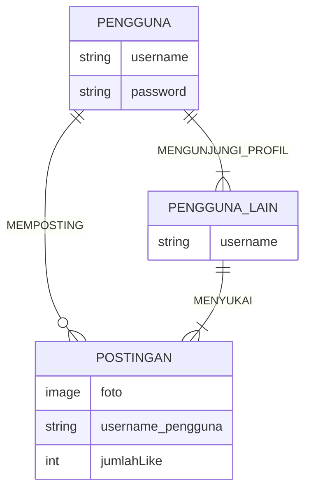

## 1.1 Latar Belakang

    Minoshots adalah sebuah aplikasi yang dibuat untuk para fotografer yang
    sedang mencari inspirasi atau ide untuk memotret. Dengan desain nya yang simple dan mempunyai fitur posting dan
    visit profile dapat memudahkan pengguna untuk berinteraksi.

## 1.2. Deskripsi Teknologi Informasi

    Teknologi Informasi adalah istilah umum untuk teknologi apa pun yang membantu manusia dalam membuat,
    mengubah, menyimpan, mengomunikasikan dan/atau menyebarkan informasi.

    Minoshots adalah sebuah aplikasi yang dibuat untuk para fotografer yang
    sedang mencari inspirasi atau ide untuk memotret. Dengan desain nya yang simple dan mempunyai fitur posting dan
    visit profile dapat memudahkan pengguna untuk berinteraksi.

## 1.3. Branding

    Merk: Minoshots
    Tagline: Inspiration comes from everywhere.
    Campaign: Membuat aplikasi yang berisi inspirasi dalam dunia fotografi.
    Target User: - Fotografer
                        - Orang yang ingin mencari inspirasi potretan
                        - Fotografer yang ingin mencari kenalan sesama fotografer
                        - Traveller yang mencari tempat-tempat indah
    Tema :
    Warna :

## 2. User Story

Sebagai | Saya ingin | Sehingga | Level Prioritas
---|---|---|---
Pengguna | Mengupload Foto | Bisa menginspirasi fotografer lain | ⭐⭐⭐⭐⭐
Pengguna | Mencari Foto | Bisa mendapatkan ide dan inspirasi | ⭐⭐⭐⭐⭐
Pengguna | Mengunjungi Profil Orang | Dapat melihat info lebih lanjut dan melihat foto lain dari uploader | ⭐⭐⭐⭐
Pengguna | Memberikan Like | Sebagai bentuk apresiasi kepada inspirator | ⭐⭐⭐

## 3. Struktur Data

## 4. Arsitektur Sistem

    Database - PostgreSQL --> Aplikasi - Java
    
## 5. Teknologi, Library, dan Framework

 
    Teknologi:  - React Native
                - PostgreSQL
 
    Library:    - x

    Framework:  - x

## 6. Desain User Experience dan User Interface
https://www.figma.com/proto/HKT4NL8fR0vwJs4x4JiDEj/Workspace-Minostudio?type=design&node-id=305-2&t=UOrDniz9dNrb5l99-0&scaling=min-zoom&page-id=0%3A1&starting-point-node-id=305%3A2
## 7. Demonstrasi Video

Link youtube nya

## 8. Bagaimana mesin komputasi dan sistem operasi berperan dalam produk teknologi informasimu ?

Link youtube nya di detik jawaban ini

## 9. Bagaimana algoritma, struktur data, dan bahasa pemrograman berperan dalam produk teknologi informasimu ?

Link youtube nya di detik jawaban ini

## 10. Bagaimana metode pengembangan perangkat lunak / Software Development Life Cycle berperan dalam produk teknologi informasimu ?

Link youtube nya di detik jawaban ini

## 11. Bagaimana database / sistem basis data berperan dalam produk teknologi informasimu ?

Link youtube nya di detik jawaban ini
