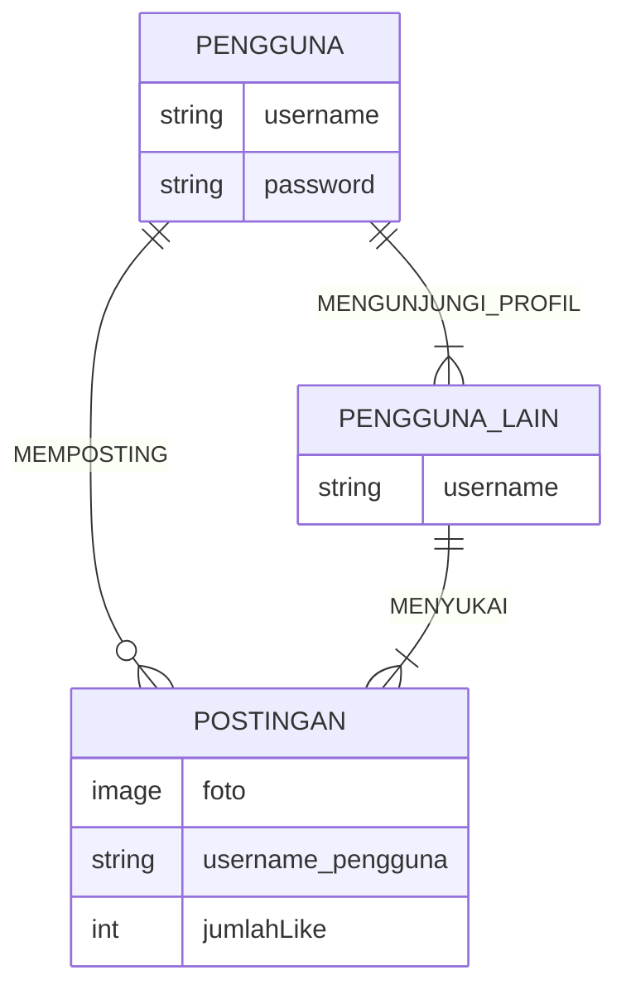

## 1.1 Latar Belakang

   Fotografi Fotografi adalah proses mengambil gambar menggunakan kamera atau perangkat lain untuk merekam detail       visual dengan bantuan cahaya pada media seperti film atau sensor digital. Tujuan dari fotografi antara lain          merekam dan berkomunikasi melalui gambar. Ini bisa digunakan untuk dokumentasi, ekspresi seni, jurnalisme,           membagi cerita, mengabadikan momen berharga, dan menyampaikan pesan atau informasi visual kepada penonton.           Fotografi memungkinkan orang untuk berbagi pengalaman, mengungkapkan ide, dan merayakan keindahan dunia dalam        bentuk gambar.

   Menurut google top sepuluh konten di instagram fotografi berada dalam urutan ke-7 yang artinya blablabala.
   sehingga saya membuat aplikasi ini agar memudahkan para fotografer atau user yang ingin mencari inspirasi terkait    fotografi. dengan aplikasi yang saya buat ini hanya dengan sekali klik user bisa langsung melihat karya-karya        dari fotografer lain tanpa harus menulis kata kunci di kolom pencarian.

   aplikasi ini juga bisa memudahkan para fotografer profesional untuk mendemostrasikan karya-karya mereka yang         nantinya bisa menarik perhatian para klien untuk memakai jasa mereka.
   
## 1.2. Deskripsi Teknologi Informasi

    Teknologi Informasi adalah istilah umum untuk teknologi apa pun yang membantu manusia dalam membuat,
    mengubah, menyimpan, mengomunikasikan dan/atau menyebarkan informasi.

    Minoshots adalah sebuah aplikasi yang dibuat untuk para fotografer yang
    sedang mencari inspirasi atau ide untuk memotret. Dengan desain nya yang simple dan mempunyai fitur posting dan
    visit profile dapat memudahkan pengguna untuk berinteraksi.

## 1.3. Branding

    Merk: Minoshots
    Tagline: Inspiration comes from everywhere.
    Campaign: Membuat aplikasi yang berisi inspirasi dalam dunia fotografi.
    Target User: - Fotografer
                        - Orang yang ingin mencari inspirasi potretan
                        - Fotografer yang ingin mencari kenalan sesama fotografer
                        - Traveller yang mencari tempat-tempat indah
    Tema :
    Warna :

## 2. User Story

Sebagai | Saya ingin | Sehingga | Level Prioritas
---|---|---|---
Pengguna | Mengupload Foto | Bisa menginspirasi fotografer lain | ⭐⭐⭐⭐⭐
Pengguna | Mencari Foto | Bisa mendapatkan ide dan inspirasi | ⭐⭐⭐⭐⭐
Pengguna | Mengunjungi Profil Orang | Dapat melihat info lebih lanjut dan melihat foto lain dari uploader | ⭐⭐⭐⭐
Pengguna | Memberikan Like | Sebagai bentuk apresiasi kepada inspirator | ⭐⭐⭐
Pengguna | Mengganti Foto Profil | Dapat Mengganti fotoo profil jika sudah bosan menggunakan foto profil yang lama | ⭐⭐⭐
Menejer | Melihat statistik | Dapat melihat info terkait jumlah user, user dengan pengikut terbanyak, user dengan like terbanyak|⭐⭐⭐⭐⭐

## 3. Struktur Data

## 4. Arsitektur Sistem

    Database - PostgreSQL --> Aplikasi - Java
    
## 5. Teknologi, Library, dan Framework

 
    Teknologi:  - React Native
                - PostgreSQL
 
    Library:    - x

    Framework:  - x

## 6. Desain User Experience dan User Interface
https://www.figma.com/proto/HKT4NL8fR0vwJs4x4JiDEj/Workspace-Minostudio?type=design&node-id=305-2&t=UOrDniz9dNrb5l99-0&scaling=min-zoom&page-id=0%3A1&starting-point-node-id=305%3A2
## 7. Demonstrasi Video

Link youtube nya

## 8. Bagaimana mesin komputasi dan sistem operasi berperan dalam produk teknologi informasimu ?

Link youtube nya di detik jawaban ini

## 9. Bagaimana algoritma, struktur data, dan bahasa pemrograman berperan dalam produk teknologi informasimu ?

Link youtube nya di detik jawaban ini

## 10. Bagaimana metode pengembangan perangkat lunak / Software Development Life Cycle berperan dalam produk teknologi informasimu ?

Link youtube nya di detik jawaban ini

## 11. Bagaimana database / sistem basis data berperan dalam produk teknologi informasimu ?

Link youtube nya di detik jawaban ini
